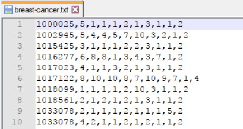

## Tratamiento y Análisis del Dataset de Cáncer de Mama      

**Gregorio de Miguel Vadillo**  
**Carlos Muñiz Solaz**

**Fecha:** Diciembre 2017 - Enero 2018


## 1. Descripción del dataset. ¿Por qué es importante y qué pregunta/problema pretende responder?

El dataset se corresponde a un conjunto de *muestras de cancer de mama* recibidas en el Dr. Wolberg, de la Universidad de Wisconsin, en el periodo comprendido entre Enero de 1989 y Noviembre de 1991.

Este dataset se puede descarga desde el siguiente enlace:   
https://archive.ics.uci.edu/ml/datasets/breast+cancer+wisconsin+(original)

El dataset consiste en 699 observaciones y 11 atributos que definen a cada observación. De los 11 atributos, 1 atributo se corresponde con el identificador de la muestra, 9 indican características de una observación y el undécimo indica la clasificación de la muestra como tumor benigno o tumor maligno. Vease a continuación información sobre los atributos:

1. Sample code number: id number
2. Clump Thickness: 1 - 10
3. Uniformity of Cell Size: 1 - 10
4. Uniformity of Cell Shape: 1 - 10
5. Marginal Adhesion: 1 - 10
6. Single Epithelial Cell Size: 1 - 10
7. Bare Nuclei: 1 - 10
8. Bland Chromatin: 1 - 10
9. Normal Nucleoli: 1 - 10
10. Mitoses: 1 - 10
11. Class: Variable categorica: 2 -> cancer es benigno, 4 -> cancer es maligno

Los valores 1 a 10 que toman los atributos 2 a 10 reflejan el grado de penetración del tumor en la célula.

Contar con una base de datos con muestras reales de cualquier emfermedad, cancer de mama en este caso, y su posterior estudio es de suma importancia, pues permitiría poder detectar la enfermedad y aplicar tratamientos en etapas de esta cada vez más precoces, lo que sin duda incrementaría la probabilidad de supervivencia del paciente. 

Muchos son los posibles objetivos que tiene este dataset, aunque nosotros vamos a utilizarlo para determinar las características que permiten diferenciar una muestra de tumor benigna de una maligna, por lo que nuestro objetido se centra en la clasificación de muestras.

### Carga del dataset en el entorno y tratamiento inicial de los datos

Como hemos comentado anteriormente, el dataset contiene 699 observaciones y 11 tributos. El archivo que lo contiene es el fichero "breast-cancer.txt" que tiene el siguiente formato.      
**NOTA.** Se muestra solamente un conjunto formado por las primeras observaciones:



Como puede observarse, el fichero no dispone de *header* y los campos están separados por comas. Por lo tanto, empleamos el siguiente comando para realizar la carga de la información del fichero dentro den entorno de desarrollo. La variable (data frame) que almacenará la información se llamará **breast_cancer_set**:


```r
breast_cancer_set<-read.table(file = "breast-cancer.txt", sep = ",")
```

Se comprueba que efectivamente en **breast_cancer_set** tenemos las 699 observaciones y los 11 atributos:


```r
dim(breast_cancer_set)
```

```
## [1] 699  11
```

Visualizamos los 10 primeros registros del data frame para comprobar la integridad de los datos:


```r
head(breast_cancer_set)
```

```
##        V1 V2 V3 V4 V5 V6 V7 V8 V9 V10 V11
## 1 1000025  5  1  1  1  2  1  3  1   1   2
## 2 1002945  5  4  4  5  7 10  3  2   1   2
## 3 1015425  3  1  1  1  2  2  3  1   1   2
## 4 1016277  6  8  8  1  3  4  3  7   1   2
## 5 1017023  4  1  1  3  2  1  3  1   1   2
## 6 1017122  8 10 10  8  7 10  9  7   1   4
```

Todos los atributos se han cargado como numéricos excepto V7, que se ha cargado como factor. Se comprueban sus niveles:


```r
levels(breast_cancer_set$V7)
```

```
##  [1] "?"  "1"  "10" "2"  "3"  "4"  "5"  "6"  "7"  "8"  "9"
```

Hay un nivel denotado como "?" que aparentemente se corresponde con datos incompletos. De acuerdo a la información del dataset, existen 16 datos incompletos. Comprobamos si se corresponden a los niveles denotados con "?":


```r
table(breast_cancer_set$V7)
```

```
## 
##   ?   1  10   2   3   4   5   6   7   8   9 
##  16 402 132  30  28  19  30   4   8  21   9
```

Efectivamente el número de "?" coincide con el número de valores incompletos. Nos interesa que todos los atributos sean numéricos, con lo cual convertimos el atributo V7 a "character". Posteriormente convertimos los "?" a NA y finálmente se transforma el atributo a "numeric":


```r
breast_cancer_set$V7<-as.character(breast_cancer_set$V7)
breast_cancer_set$V7[breast_cancer_set$V7 == "?"]<-NA
breast_cancer_set$V7<-as.numeric(breast_cancer_set$V7)
```

El resultado es el siguiente:


```r
breast_cancer_set$V7
```

```
##   [1]  1 10  2  4  1 10 10  1  1  1  1  1  3  3  9  1  1  1 10  1 10  7  1
##  [24] NA  1  7  1  1  1  1  1  1  5  1  1  1  1  1 10  7 NA  3 10  1  1  1
##  [47]  9  1  1  8  3  4  5  8  8  5  6  1 10  2  3  2  8  2  1  2  1 10  9
##  [70]  1  1  2  1 10  4  2  1  1  3  1  1  1  1  2  9  4  8 10  1  1  1  1
##  [93]  1  1  1  1  1  1  6 10  5  5  1  3  1  3 10 10  1  9  2  9 10  8  3
## [116]  5  2 10  3  2  1  2 10 10  7  1 10  1 10  1  1  1 10  1  1  2  1  1
## [139]  1 NA  1  1  5  5  1 NA  8  2  1 10  1 10  5  3  1 10  1  1 NA 10 10
## [162]  1  1  3 NA  2 10  1  1  1  1  1  1 10 10 10  1  1  1 10  1  1  1 10
## [185] 10  1  8 10  8  1  8 10  1  1  1  1  7  1  1  1 10 10  1  1  1 10  5
## [208]  1  1  1 10  8  1 10 10  5  1  1  4  1  1 10  5  8 10  1 10  5  1 10
## [231]  7  8  1 10  1 NA 10  2  9 10  2  1  1  5  1  2 10  9  1 NA  1 10 10
## [254] 10  8 10  1  1  1  8 10 10 10 10  3  1 10 10  4  1 10  1 10  4  1 NA
## [277]  1  1  1  7  1  1 10 10 10 10 10  1  5 10  1  1 NA 10 NA 10  5 NA  1
## [300] 10  4  1 10  1 10 10  1  1  3  5  1  1  1  1  1 NA 10  8  1  5 10 NA
## [323]  1 10  1  1 10  1  4 10  8  1  1 10 10  1 10  1  1 10 10  1  1  1 10
## [346]  1  1  1  1  8  1  1  3 10  1  1  3 10  4  7 10 10  3  3  1  1 10 10
## [369]  1  1  1  1  1  1  1  1  1  1  1  1  1 10  1  1  1  1 10  1  1  2  1
## [392] 10  1  1  1  1  1  1  1  1  9  1  1  4  1  1  1  1  2  1  1 NA  4  1
## [415] 10  3 10  1  2  1  3 10  1  1  1 10  1  2  1  1  1  1  1  1  8 10  1
## [438]  1  1  1 10  4  3  2  1  1  1  1  1 10  1  1  1 10  1  6 10  3  1  1
## [461]  1  5  1  1  1  4 10 10  1  1  1  1  1  1  1  1  1  1  1 10  1  1  5
## [484] 10  1  3  1 10  3  4  1 10  1 10  5  1  1  1  1  1  1  1  1  1  1  1
## [507]  5  4  1  1  1  1  1  1 10 10  1  1  1 10  1  1  5 10  1  1  1  1  1
## [530]  1 10  1  1  1  1  1  1  1  1  1  2  1  1  1  1  1 10  1  1  5  1  1
## [553]  1  5  1  1  1  1  1  1  1  1  1  1  1 10  1  3 10  5 10 10  1  1  2
## [576]  1  1  1  1  1  1 10 10  1  1  1 10  1  3  1  1 10 10  1 10  1  1  1
## [599]  1  1  1  1  1  1 10  8  1  1 10  1 10  2 10  1  1  1  1 NA  1  1  1
## [622]  2  1  1  1  4  6  5  1  1  1  1  1  3  1  1  1  2  1  1  1  1  1  1
## [645]  1  1  1  1  2  1  4  1  1  1  1  1  1  1 10  1  1  1  1  1  1  1  1
## [668]  1  1  5  8  1  1  1  1  1  1  1  1  1 10 10  1  1  1  1  1  1  1  1
## [691]  1  5  1  1  2  1  3  4  5
```

Los 16 valores incompletos representan el 2,3% de las muestras, lo cual no supone un gran impacto en la calidad del dataset, por lo que decidimos eliminarlas del dataset original. Se crea un nuevo data frame con todas las muestras excepto aquellas que contengan un valor del atributo V7 igual a NA. Llamaremos **breast_cancer_clean** a la nueva variable:


```r
breast_cancer_clean<-breast_cancer_set[complete.cases(breast_cancer_set),]
```

El resultado debe ser un dataset con 683 observaciones y 11 atributos:


```r
dim(breast_cancer_clean)
```

```
## [1] 683  11
```

A continuación se renombran las columnas, de forma que los nombres de los atributos tengan sentido, y se visualizan los primeros registros para comprobar que los atributos han cambiado correctamente:


```r
colnames(breast_cancer_clean)<-c("id", "clump.thick", "uniform.size", "uniform.shape", "adhesion", "epithelial.cell.size", "bare.nuclei", "bland.chromatin", "nucleoli","mitoses","class")
head(breast_cancer_clean)
```

```
##        id clump.thick uniform.size uniform.shape adhesion
## 1 1000025           5            1             1        1
## 2 1002945           5            4             4        5
## 3 1015425           3            1             1        1
## 4 1016277           6            8             8        1
## 5 1017023           4            1             1        3
## 6 1017122           8           10            10        8
##   epithelial.cell.size bare.nuclei bland.chromatin nucleoli mitoses class
## 1                    2           1               3        1       1     2
## 2                    7          10               3        2       1     2
## 3                    2           2               3        1       1     2
## 4                    3           4               3        7       1     2
## 5                    2           1               3        1       1     2
## 6                    7          10               9        7       1     4
```


## 2. Limpieza de los datos
### A. Selección de los datos de interés a analizar. ¿Cuáles son los campos más relevantes para responder al problema?

Para realizar el estudio de las muestras, utilizaremos la información proporcionada por los atributos 2 al 10, es decir, todos los atributos excepto "id" y "class". El atributo "id" nos permite identificar de forma unívoca a una muestra dentro del conjunto de muestras, pero es simplemente un identificador, no proporciona ninguna información valiosa de las características de la muestra. El atributo "class" indica la clase a la que pertenece la muestra. Es decir, ha sido añadido a posteriori una vez que se han estudiado el resto de características de la prueba. Por tanto, lo descartamos para nuestro análisis. Este campo si que será importante más adelante, ya que nos servirá para comprobar si nuestro estudio clasifica las muestras correctamente. Por ello, creamos un vector para almacenar los valores del atributo "class" y poder ser utilizado posteriormente. La variable se llamará **clases_objetivo**:


```r
clases_objetivo<-breast_cancer_clean$class
```

Modificamos el dataset **breast_cancer_clean** eliminamos el atributo "id":


```r
breast_cancer_clean<-subset(breast_cancer_clean,,-c(id))
```

Cambiamos la clase a "B" y a "M", si el tumor es Benigno o Maligno:


```r
breast_cancer_clean$class <- factor (breast_cancer_clean$class, labels = c("B", "M"))
```

El nuevo dataset deberá tener 683 observaciones y 10 atributos:


```r
dim(breast_cancer_clean)
```

```
## [1] 683  10
```


### B. ¿Los datos contienen ceros o elementos vacíos? ¿Y valores extremos? ¿Cómo gestionarías cada uno de estos casos?

Como se comprobó anterioremte, el *dataset original* contenía 16 valores incompletos. En este caso, una vez detectados pasamos a su eliminación, tras comprobar que no suponía un gran impacto en la calidad del dataset resultante.

Realizamos la comprobación de la no existencia de valores extremos:


```r
summary(breast_cancer_clean)
```

```
##   clump.thick      uniform.size    uniform.shape       adhesion    
##  Min.   : 1.000   Min.   : 1.000   Min.   : 1.000   Min.   : 1.00  
##  1st Qu.: 2.000   1st Qu.: 1.000   1st Qu.: 1.000   1st Qu.: 1.00  
##  Median : 4.000   Median : 1.000   Median : 1.000   Median : 1.00  
##  Mean   : 4.442   Mean   : 3.151   Mean   : 3.215   Mean   : 2.83  
##  3rd Qu.: 6.000   3rd Qu.: 5.000   3rd Qu.: 5.000   3rd Qu.: 4.00  
##  Max.   :10.000   Max.   :10.000   Max.   :10.000   Max.   :10.00  
##  epithelial.cell.size  bare.nuclei     bland.chromatin     nucleoli    
##  Min.   : 1.000       Min.   : 1.000   Min.   : 1.000   Min.   : 1.00  
##  1st Qu.: 2.000       1st Qu.: 1.000   1st Qu.: 2.000   1st Qu.: 1.00  
##  Median : 2.000       Median : 1.000   Median : 3.000   Median : 1.00  
##  Mean   : 3.234       Mean   : 3.545   Mean   : 3.445   Mean   : 2.87  
##  3rd Qu.: 4.000       3rd Qu.: 6.000   3rd Qu.: 5.000   3rd Qu.: 4.00  
##  Max.   :10.000       Max.   :10.000   Max.   :10.000   Max.   :10.00  
##     mitoses       class  
##  Min.   : 1.000   B:444  
##  1st Qu.: 1.000   M:239  
##  Median : 1.000          
##  Mean   : 1.603          
##  3rd Qu.: 1.000          
##  Max.   :10.000
```

Como se puede comprobar, los valores de los atributos están comprendidos en el rango [1-10], y se corresponde con los valores que se indicaban en la información del dataset original. Es decir, no hay valores extremos.

En el caso de haber detectado la presencia de algún valor fuera del rango de valores permitidos podríamos optar por alguna de las siguientes soluciones:

**Eliminación del registro que los contiene.** Dependería de si el número de registros afectados no tiene un gran impacto en la calidad del dataset resultante.

**Ajustar el valor al límite más cercano.** Tendríamos que hacer la asumpción de que un valor mayor que 10 es 10 y un valor menor que 1 es 1.

## 3. Análisis de los datos

A partir de ahora sólo trabajaremos sobre el dataset *breast_cancer_clean*.

### 3.1. Selección de los grupos de datos que se quieren analizar/comparar

Analizaremos y compararemos todos los atributos del dataset para identificar cuales de ellos son los importantes para clasificar si el cancer es *benigno* o *maligno*. 
En primer lugar, observamos que el dataset no está equilibrado:


```r
barplot (table(breast_cancer_clean$class), xlab = "Tipo de cancer", ylab = "numero de casos", col=c("darkblue","red"), main = "Distribución de clases en el dataset breast_cancer_clean")
```

<!-- -->

```r
prop.table(table(breast_cancer_clean$class))
```

```
## 
##         B         M 
## 0.6500732 0.3499268
```

Vemos que hay más caso de cancer *begnino* que *maligno*. Esto es lo esperado en el caso de dataset con enfermedades. 

También se puede observar que existe una alta correlación entre la variable *uniform.size* y *uniform.shape*


```r
corr_mat <- cor(breast_cancer_clean[,1:9])
corrplot(corr_mat, order = "hclust", tl.cex = 1, addrect = 8)
```

<!-- -->

Podemos mostrar las distribuciones de las variables según el cancer es "benigno" o "maligno"


```r
benign <- breast_cancer_clean[breast_cancer_clean$class == "B", ]
malign <- breast_cancer_clean[breast_cancer_clean$class == "M", ]
par(mfrow=c(3,3))
for (i in 1:9) {
   hist(benign[[i]], col = c("darkblue"), main = colnames(benign)[i], xlab = "");
   hist (malign[[i]], col = c("red"), add = T)    
}
```

<!-- -->

Se puede observar que para casi todas las variables, los valores para el caso de cancer "benigno" son muy pequeños. Sin embargo, para el cancer "maligno" los valores están mucho más distribuidos.


### 3.2. Comprobación de la normalidad y homogeneidad de la varianza. Si es necesario (y posible), aplicar transformaciones que normalicen los datos.

Para comprobar la normalidad de las distintas variables podemos utilizar gráficas Q-Q y comprobar si diferen de una distribución normal.


```r
par(mfrow=c(3,3))
for (i in 1:9) {
     q1 <- qqnorm(benign[[i]], plot.it = FALSE)
     q2 <- qqnorm(malign[[i]], plot.it = FALSE)
     plot(range(q1$x, q2$x), range(q1$y, q2$y), type = "n", xlab ="", ylab = "", main = colnames(benign)[i])
     points(q1, col = "blue")
     points(q2, col = "red", pch = 3)
     abline(a=mean(benign[[i]]),b=sd(benign[[i]]))
     abline(a=mean(malign[[i]]),b=sd(malign[[i]]))
}
```

<!-- -->

Visualmente se puede comprobar que ninguna de las variables sigue una distribución normal ya que los puntos están fuera de la linea recta.

Para comprobar analiticamente que ninguna de las variables sigue una distribución normal podemos usar el **test de Shapiro-Wilks*:

**Test de Shapiro-Wilks**


```r
shapiro.test (benign$clump.thick)
```

```
## 
## 	Shapiro-Wilk normality test
## 
## data:  benign$clump.thick
## W = 0.88886, p-value < 2.2e-16
```

```r
shapiro.test (malign$clump.thick)
```

```
## 
## 	Shapiro-Wilk normality test
## 
## data:  malign$clump.thick
## W = 0.90093, p-value = 1.871e-11
```

```r
shapiro.test (benign$uniform.size)
```

```
## 
## 	Shapiro-Wilk normality test
## 
## data:  benign$uniform.size
## W = 0.40518, p-value < 2.2e-16
```

```r
shapiro.test (malign$uniform.size)
```

```
## 
## 	Shapiro-Wilk normality test
## 
## data:  malign$uniform.size
## W = 0.90153, p-value = 2.058e-11
```
El test lo he aplicado para las variables **clump.thick** y **uniform.size**. Se puede ver como en ambos casos el *p-valor* es muy inferior a 0.05, con lo cual podemos rechazar la hipotésis nula y asumir que las variables no siguen una distribución normal.
Podemos mostrar la función de distribución para comprobar sigue o no forma de campana:


```r
ggdensity(breast_cancer_clean$clump.thick, 
         main = "Grafico de Densidad del clump thick",
         xlab = "Tamaño del clump thick")
```

<!-- -->

Como se puede observar una vez más la distribución no sigue una forma de campana, con lo que concluimos que las variables de nuestro dataset no siguen distribuciones normales.

Vamos a intentar transformar las variables a distribuciones normales:


```r
par(mfrow=c(3,1))
plotNormalHistogram(benign$clump.thick, xlab = "clump.thick", main = "Distribucion sin transformar")
plotNormalHistogram(log10(benign$clump.thick + 1), main = "Usando una transformación logaritmica")
plotNormalHistogram(sqrt(benign$clump.thick), main = "Usando una transformación de raíz cuadrada")
```

<!-- -->

- Hemos usado dos transformaciones para intentar normalizar la distribución. Una **transformación logaritmica** y una **transformación de raiz cuadrada**. 
- De las tres distribución la que más se acerca a una normal es la **transformación logaritmica**.

Aún así, esta distribución también falla el test de normalidad de Shapiro.
Es por ello, que si queremos realizar pruebas estadisticas tendremos que realizarlas con **tests no parámetricos**.

**Análisis de varianza**

Ya sabemos que las distribuciones de las variables para cada una de las clases no son normales y que sólo tenemos dos clases. Normalmente, el análisis de varianza se aplica cuando tenemos más de dos clases para ver si la varianza entre las dos distribuciones es la misma o difieren. Y en caso de que difieran, entre cuales de las clases.
Aunque sabemos que no podemos aplicar **ANOVA** en este caso ya que las distribuciones no son normales vamos a aplicarlo para ver que nos dice sobre la varianza entre las clases:


```r
anova(lm (breast_cancer_clean$clump.thick ~ breast_cancer_clean$class))
```

```
## Analysis of Variance Table
## 
## Response: breast_cancer_clean$clump.thick
##                            Df Sum Sq Mean Sq F value    Pr(>F)    
## breast_cancer_clean$class   1 2772.5  2772.5  711.42 < 2.2e-16 ***
## Residuals                 681 2653.9     3.9                      
## ---
## Signif. codes:  0 '***' 0.001 '**' 0.01 '*' 0.05 '.' 0.1 ' ' 1
```

Nos sale un *p-valor* muy inferior a 0.05, con lo cual podemos rechazar la hipotésis nula y asumir que la varianza de las dos clases son distintas.

En este caso una manera muy sencilla de ver que las distribuciones son muy distintas es usando boxplots:


```r
par(mfrow=c(3,3))
for (i in 1:9) {
  boxplot(breast_cancer_clean[[i]] ~ breast_cancer_clean$class, ylab = colnames(breast_cancer_clean)[i], xlab = "Tipo de Cancer", col = c("darkblue", "red"))
}
```

<!-- -->

Para finalizar, vamos a realizar el **análisis de varianza** utilizando un **método no parámetrico** como el de Kruskal:


```r
cancer.kruskal = kruskal.test(clump.thick~class,data=breast_cancer_clean)
```


```r
print(cancer.kruskal)
```

```
## 
## 	Kruskal-Wallis rank sum test
## 
## data:  clump.thick by class
## Kruskal-Wallis chi-squared = 318.22, df = 1, p-value < 2.2e-16
```

El *p-valor* es inferior a 0.05, con lo que la varianza de las dos clases son distintas.


### 3.3. Aplicación de pruebas estadísticas (tantas como sea posible) para comparar los grupos de datos.

* **Test de dos muestras**

Podemos usar el **test de Wilcoxon** que utiliza métodos no parámetricos para probar que las distribuciones de las dos clases de cancer son distintas:


```r
wilcox.test(breast_cancer_clean$clump.thick ~ breast_cancer_clean$class)
```

```
## 
## 	Wilcoxon rank sum test with continuity correction
## 
## data:  breast_cancer_clean$clump.thick by breast_cancer_clean$class
## W = 9669.5, p-value < 2.2e-16
## alternative hypothesis: true location shift is not equal to 0
```

El *p-valor* es inferior a 0.05, con lo que rechazamos la hipotesis nula.
 
* **Test de una muestra**

Podemos intentar probar que la media del clump.thick de las muestras de *cancer maligno* son distintas a la media de las muestras de *cancer benigno*.


```r
 wilcox.test(benign$clump.thick, mu = mean (malign$clump.thick))
```

```
## 
## 	Wilcoxon signed rank test with continuity correction
## 
## data:  benign$clump.thick
## V = 14, p-value < 2.2e-16
## alternative hypothesis: true location is not equal to 7.188285
```

El *p-valor* es inferior a 0.05, con lo que rechazamos la hipotesis nula.


* **Test de Barlett**

Podemos usar el test de Barlett para comprobar para probar si k muestras provienen de poblaciones con la misma varianza. A las varianzas iguales a través de las muestras se llama *homogeneidad de varianzas*. El análisis de la varianza ANOVA, suponen que las varianzas son iguales en todos los grupos o muestras. La prueba de Bartlett se puede utilizar para verificar esa suposición.


```r
bartlett.test(breast_cancer_clean$clump.thick ~ breast_cancer_clean$class)
```

```
## 
## 	Bartlett test of homogeneity of variances
## 
## data:  breast_cancer_clean$clump.thick by breast_cancer_clean$class
## Bartlett's K-squared = 46.293, df = 1, p-value = 1.018e-11
```

* **Regresión lineal múltiple**

Generando un modelo de regresión multiple podremos analizar el nivel de influencia de un conjunto de variables respecto a otra. Se estudiará que variable ejerce mayor influencia positiva y mayor influencia negativa sobre la variable dependiente.

El estudio se divide en los grupos de muestras benignas y malignas.

Por tanto, vamos generando modelos modificando la variable dependiente en cada caso.

**Regresión multiple en muestras benignas**

*clump.thick*

```r
sort(glm(clump.thick ~ uniform.size + uniform.shape + adhesion + epithelial.cell.size + bare.nuclei + bland.chromatin + nucleoli + mitoses, data = benign)$coefficients)
```

```
##              mitoses          bare.nuclei epithelial.cell.size 
##          -0.16343782          -0.12336074          -0.01416644 
##      bland.chromatin             nucleoli         uniform.size 
##           0.01560149           0.10588738           0.19886969 
##        uniform.shape             adhesion          (Intercept) 
##           0.32705158           0.37039213           1.94680175
```

Las variables **mitoses**, **bare.nuclei** y **epithelial.cell.size** ejercen una influencia negativa, es decir, cuando aumentan **clump.thick** disminuye. La variable que meyor influencia positiva ejerce es **adhesion**

*uniform.size*

```r
sort(glm(uniform.size ~ clump.thick + uniform.shape + adhesion + epithelial.cell.size + bare.nuclei + bland.chromatin + nucleoli + mitoses, data = benign)$coefficients)
```

```
##          (Intercept)             adhesion          clump.thick 
##          -0.08838158           0.00527316           0.02515843 
##              mitoses      bland.chromatin epithelial.cell.size 
##           0.03680100           0.04402880           0.08310996 
##          bare.nuclei             nucleoli        uniform.shape 
##           0.12799446           0.14716078           0.45876501
```

Todas las variables ejercen influencia positiva en **benign**, pero la que ejerce mayor influencia es **uniform.shape**.

*adhesion*

```r
sort(glm(adhesion ~ clump.thick + uniform.shape + uniform.size + epithelial.cell.size + bare.nuclei + bland.chromatin + nucleoli + mitoses, data = benign)$coefficients)
```

```
##      bland.chromatin        uniform.shape         uniform.size 
##         -0.003890785          0.006203877          0.011463968 
##             nucleoli              mitoses          clump.thick 
##          0.059875786          0.062311326          0.101868684 
## epithelial.cell.size          bare.nuclei          (Intercept) 
##          0.145316650          0.214745288          0.291794791
```

**bland.chromatin** ejerce influencia negativa sobre **adhesion**, pero en un coeficiente muy bajo. La que mayor influencia positiva ejerce es **bare.nuclei**.

*uniform.shape*

```r
sort(glm(uniform.shape ~ clump.thick + adhesion + uniform.size + epithelial.cell.size + bare.nuclei + bland.chromatin + nucleoli + mitoses, data = benign)$coefficients)
```

```
##              mitoses      bland.chromatin             adhesion 
##         -0.060025131         -0.008780321          0.004259854 
##          bare.nuclei             nucleoli epithelial.cell.size 
##          0.033158932          0.041650251          0.048485136 
##          clump.thick          (Intercept)         uniform.size 
##          0.061762771          0.213844560          0.684834881
```

Tanto **mitoses** como **bland.chromatin** ejercen influencia negativa, pero los coeficientes son muy bajos. La varaible que mayor influencia positiva ejerce es **uniform.size**.


*epithelial.cell.size*

```r
sort(glm(epithelial.cell.size ~ clump.thick + adhesion + uniform.size + uniform.shape + bare.nuclei + bland.chromatin + nucleoli + mitoses, data = benign)$coefficients)
```

```
##         mitoses bland.chromatin     clump.thick   uniform.shape 
##    -0.110205936    -0.033473681    -0.003256003     0.059009541 
##     bare.nuclei        adhesion    uniform.size        nucleoli 
##     0.090642075     0.121439669     0.150994899     0.266465850 
##     (Intercept) 
##     1.402465474
```


**mitoses**, **bland.chromatin** y **clump.thick** influyen de forma negativa. **nucleoli** es la que más influye positivamente.


*bare.nuclei*

```r
sort(glm(bare.nuclei ~ clump.thick + adhesion + uniform.size + uniform.shape + epithelial.cell.size + bland.chromatin + nucleoli + mitoses, data = benign)$coefficients)
```

```
##          (Intercept)          clump.thick             nucleoli 
##          -0.31288010          -0.04920851           0.01564923 
##        uniform.shape      bland.chromatin epithelial.cell.size 
##           0.07004115           0.08634320           0.15731456 
##              mitoses             adhesion         uniform.size 
##           0.21453837           0.31146406           0.40358915
```

La variable **clump.thick** influye negativamente, mientras que **uniform.size** es que la influye de forma positiva con más fuerza.


*bland.chromatin*

```r
sort(glm(bland.chromatin ~ clump.thick + adhesion + uniform.size + uniform.shape + epithelial.cell.size + bare.nuclei + nucleoli + mitoses, data = benign)$coefficients)
```

```
##              mitoses epithelial.cell.size        uniform.shape 
##         -0.160733752         -0.058566410         -0.018696880 
##             adhesion          clump.thick          bare.nuclei 
##         -0.005688890          0.006273869          0.087043066 
##         uniform.size             nucleoli          (Intercept) 
##          0.139955893          0.322934458          1.686177798
```

**mitoses**, **epithelial.cell.size**, **uniform.shape** y **adhesion** influyen de forma negativa sobre **bland.chromatin** mientras que **nucleoli** es la que influye de forma más positiva.

*nucleoli*

```r
sort(glm(nucleoli ~ clump.thick + adhesion + uniform.size + uniform.shape + epithelial.cell.size + bare.nuclei + bland.chromatin + mitoses, data = benign)$coefficients)
```

```
##          (Intercept)          bare.nuclei          clump.thick 
##         -0.451960875          0.009502359          0.025647558 
##             adhesion        uniform.shape              mitoses 
##          0.052731985          0.053420622          0.105639460 
##      bland.chromatin epithelial.cell.size         uniform.size 
##          0.194512245          0.280814319          0.281759759
```

Todas influyen de forma positiva en **nucleoli**, pero la que lo hace con mayor fuerza es **uniform.size**

*mitoses*

```r
sort(glm(mitoses ~ clump.thick + adhesion + uniform.size + uniform.shape + epithelial.cell.size + bare.nuclei + bland.chromatin + nucleoli, data = benign)$coefficients)
```

```
## epithelial.cell.size      bland.chromatin        uniform.shape 
##          -0.05007245          -0.04174033          -0.03319255 
##          clump.thick             adhesion         uniform.size 
##          -0.01706753           0.02365953           0.03037824 
##             nucleoli          bare.nuclei          (Intercept) 
##           0.04554517           0.05616422           1.15073000
```

Por último, **mitoses** se ve influenciada negativamente por **epithelial.cell.size**, **bland.chromatin**, **uniform.shape** y **clump.thick**. **bare.nuclei** es la que influye de forma más positiva.


En el caso de muestras de tumor benigno, observamos que la mayoría de las variables tienen una influencia positiva en el resto. Aquellas que influyen de forma negativa lo hacen en coeficientes tan bajos que el cambio apenas es apreciable. La mayor influencia entre variables la encontramos entre **uniform.size** y **uniform.shape** de forma bidireccional. Por tanto a medida que aumente una debería aumentar la otra. 


**Regresión multiple en muestras malignas**

Se repite el proceso para las muestras de tumor malignas. En este caso se incluirá un comentario final, ya que los resultados de los coeficientes de cada modelo de regresión hablan por si solos en cada caso. 

*clump.thick*

```r
sort(glm(clump.thick ~ uniform.size + uniform.shape + adhesion + epithelial.cell.size + bare.nuclei + bland.chromatin + nucleoli + mitoses, data = malign)$coefficients)
```

```
##             adhesion epithelial.cell.size             nucleoli 
##         -0.161317667         -0.065322150         -0.039547340 
##      bland.chromatin          bare.nuclei         uniform.size 
##         -0.003310652          0.001825464          0.087336581 
##        uniform.shape              mitoses          (Intercept) 
##          0.104809583          0.140906252          7.046033596
```

*uniform.size*

```r
sort(glm(uniform.size ~ clump.thick + uniform.shape + adhesion + epithelial.cell.size + bare.nuclei + bland.chromatin + nucleoli + mitoses, data = malign)$coefficients)
```

```
##          bare.nuclei             nucleoli              mitoses 
##          -0.08698903           0.01309934           0.02101244 
##          clump.thick             adhesion      bland.chromatin 
##           0.04727483           0.09200950           0.15468215 
## epithelial.cell.size          (Intercept)        uniform.shape 
##           0.19977919           0.29654215           0.60525687
```

*adhesion*

```r
sort(glm(adhesion ~ clump.thick + uniform.shape + uniform.size + epithelial.cell.size + bare.nuclei + bland.chromatin + nucleoli + mitoses, data = malign)$coefficients)
```

```
##          clump.thick epithelial.cell.size        uniform.shape 
##         -0.227429446         -0.007712226          0.019955668 
##             nucleoli          bare.nuclei              mitoses 
##          0.043587342          0.180398620          0.193618400 
##         uniform.size      bland.chromatin          (Intercept) 
##          0.239642372          0.288793764          1.693791019
```

*uniform.shape*

```r
sort(glm(uniform.shape ~ clump.thick + adhesion + uniform.size + epithelial.cell.size + bare.nuclei + bland.chromatin + nucleoli + mitoses, data = malign)$coefficients)
```

```
##              mitoses             adhesion      bland.chromatin 
##          0.007509988          0.007713453          0.041224087 
## epithelial.cell.size          clump.thick          bare.nuclei 
##          0.054491004          0.057114753          0.069224515 
##             nucleoli          (Intercept)         uniform.size 
##          0.076206638          0.568700048          0.609330943
```

*epithelial.cell.size*

```r
sort(glm(epithelial.cell.size ~ clump.thick + adhesion + uniform.size + uniform.shape + bare.nuclei + bland.chromatin + nucleoli + mitoses, data = malign)$coefficients)
```

```
##     clump.thick     bare.nuclei        adhesion        nucleoli 
##    -0.051086775    -0.013121120    -0.004278219     0.033799494 
## bland.chromatin   uniform.shape         mitoses    uniform.size 
##     0.043859441     0.078203378     0.221240499     0.288645274 
##     (Intercept) 
##     2.370137538
```

*bare.nuclei*

```r
sort(glm(bare.nuclei ~ clump.thick + adhesion + uniform.size + uniform.shape + epithelial.cell.size + bland.chromatin + nucleoli + mitoses, data = malign)$coefficients)
```

```
##         uniform.size             nucleoli              mitoses 
##         -0.256979954         -0.119818441         -0.040661813 
## epithelial.cell.size          clump.thick      bland.chromatin 
##         -0.026828194          0.002919052          0.185560805 
##        uniform.shape             adhesion          (Intercept) 
##          0.203133323          0.204614786          6.663149342
```

*bland.chromatin*

```r
sort(glm(bland.chromatin ~ clump.thick + adhesion + uniform.size + uniform.shape + epithelial.cell.size + bare.nuclei + nucleoli + mitoses, data = malign)$coefficients)
```

```
##              mitoses          clump.thick epithelial.cell.size 
##         -0.084975958         -0.002368263          0.040117274 
##        uniform.shape          bare.nuclei             nucleoli 
##          0.054115301          0.083010690          0.098416297 
##             adhesion         uniform.size          (Intercept) 
##          0.146534332          0.204419692          2.271628657
```

*nucleoli*

```r
sort(glm(nucleoli ~ clump.thick + adhesion + uniform.size + uniform.shape + epithelial.cell.size + bare.nuclei + bland.chromatin + mitoses, data = malign)$coefficients)
```

```
##          bare.nuclei          clump.thick         uniform.size 
##          -0.12625676          -0.06663721           0.04077698 
##             adhesion epithelial.cell.size              mitoses 
##           0.05209489           0.07282185           0.18365387 
##      bland.chromatin        uniform.shape          (Intercept) 
##           0.23181963           0.23563783           2.94371223
```

*mitoses*

```r
sort(glm(mitoses ~ clump.thick + adhesion + uniform.size + uniform.shape + epithelial.cell.size + bare.nuclei + bland.chromatin + nucleoli, data = malign)$coefficients)
```

```
##          (Intercept)      bland.chromatin          bare.nuclei 
##          -0.69749216          -0.11641758          -0.02492051 
##        uniform.shape         uniform.size             nucleoli 
##           0.01350613           0.03804359           0.10681675 
##             adhesion          clump.thick epithelial.cell.size 
##           0.13459245           0.13809218           0.27723971
```

Los resultados obtenidos en el caso de muestras tumorales malignas son similares a las obtenidas en muestras benignas. Las variables que ejercen influencia negativa lo hacen a un nivel muy bajo. De nuevo encontramos que **uniform.shape** y **uniform.size** ejercen una gran influencia la una respecto a la otra de forma bidireccional.


* **Estudio de las medias de las poblaciones**

Al dividir el conjunto de datos originales en 2 subconjuntos claramente diferenciados, hemos aplicado clustering de forma manual. Al igual que lo haría un algoritmo de clustering para crear los centros de los grupos, podemos realizar una comparación de las medias de las variables de ambos grupos para comprobar si podemos establecer alguna diferencia entre los grupos:


```r
benign_mean<-sapply(benign[,1:9], mean)
malign_mean<-sapply(malign[,1:9], mean)

(df<-as.data.frame(t(cbind(benign_mean, malign_mean))))
```

```
##             clump.thick uniform.size uniform.shape adhesion
## benign_mean    2.963964     1.306306      1.414414 1.346847
## malign_mean    7.188285     6.577406      6.560669 5.585774
##             epithelial.cell.size bare.nuclei bland.chromatin nucleoli
## benign_mean             2.108108    1.346847        2.083333 1.261261
## malign_mean             5.326360    7.627615        5.974895 5.857741
##              mitoses
## benign_mean 1.065315
## malign_mean 2.602510
```

A continuación mostramos de menor a mayor la diferencia entre las variables de ambas poblaciones:


```r
sort(sapply(df, diff))
```

```
##              mitoses epithelial.cell.size      bland.chromatin 
##             1.537195             3.218252             3.891562 
##          clump.thick             adhesion             nucleoli 
##             4.224321             4.238927             4.596479 
##        uniform.shape         uniform.size          bare.nuclei 
##             5.146255             5.271100             6.280768
```

Las muestras de tumores benignos y malignos muestran las mayores diferencias respecto a las variables **bare.nuclei**, **uniform.size** y **uniform.shape**, por lo que se puede usar esta información, por lo que podríamos concluir que estos son los 3 atributos más determinantes para distinguir una muestra. Por otro lado y siguiente este razonamiento, la variable **mitoses** sería la menos determinante a la hora de distinguir una muestra de otra.

## 4. Conclusiones del Análisis

Después de analizar el dataset podemos concluir que:

- Las observaciones del dataset no están **equilibradas**. Tenemos más observaciones de cáncer benigno que de cáncer maligno
- Las 9 variables numéricas que componen el dataset están poco correlacionadas entre ellas, salvo las variables **uniform.size** y **uniform.shape**
- Las distribuciones de las observaciones de cáncer benigno y cáncer maligno son distintas. La distribuciones de cáncer benigno tienen números bajos en todas las variables, mientras que las distribuciones de cáncer maligno están más distribuidas en el rango de las variables y en algunos casos toma valores altos como es el **bare.nuclei**
- Se observan grandes diferencias entre los centros de las poblaciones, lo que nos da una idea de los atributos que pueden ser más significativos a la hora de distinguir muestras.
- Las distribuciones de las variables no siguen una distribución normal y son distintas entre ellas para todas las variables. Tanto la media como la varianza.
- Al no ser distribuciones normales hemos necesitado de tests no paramétricos para comprobarlo
- Podemos a partir del análisis de este dataset usar algoritmos de minería de datos que nos permitan construir modelos que clasifiquen automáticamente las muestras
